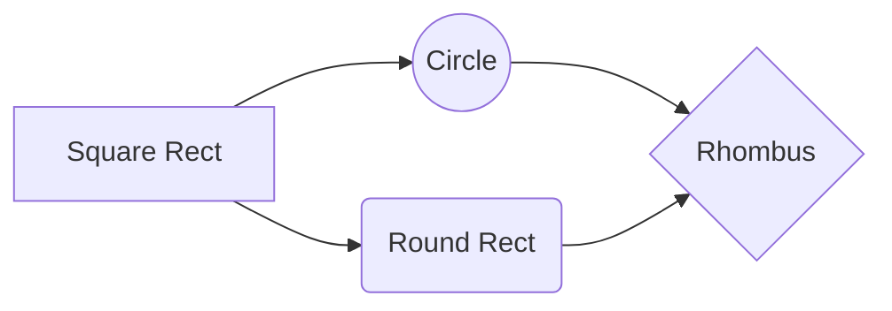
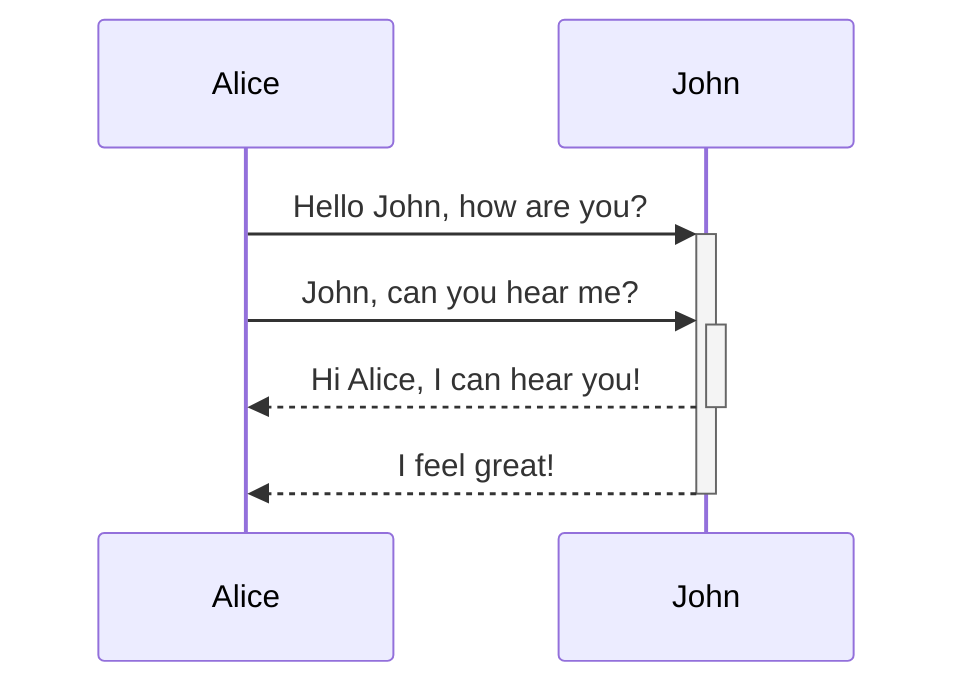

# Room

```mermaid
graph LR
    A[Square Rect] --> B((Circle))
    A --> C(Round Rect)
    B --> D{Rhombus}
    C --> D
```

```mermaid
sequenceDiagram
    Alice->>+John: Hello John, how are you?
    Alice->>+John: John, can you hear me?
    John-->>-Alice: Hi Alice, I can hear you!
    John-->>-Alice: I feel great!
```